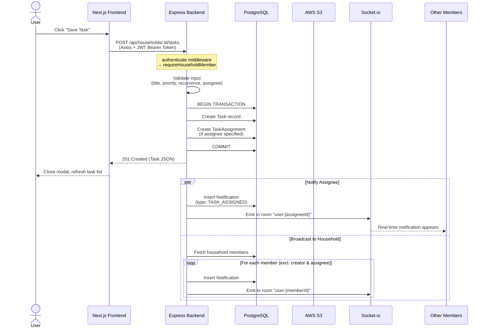

```mermaid
sequenceDiagram
  actor User
  participant UI as Next.js Frontend
  participant API as Express Backend
  participant DB as PostgreSQL
  participant S3 as AWS S3
  participant WS as Socket.io
  participant Member as Other Members
 
  User->>UI: Click "Save Task"
  UI->>API: POST /api/households/:id/tasks<br/>(Axios + JWT Bearer Token)
 
  Note over API: authenticate middleware<br/>→ requireHouseholdMember
 
  API->>API: Validate input<br/>(title, priority, recurrence, assignee)
 
  API->>DB: BEGIN TRANSACTION
  API->>DB: Create Task record
  API->>DB: Create TaskAssignment<br/>(if assignee specified)
  API->>DB: COMMIT
 
  API-->>UI: 201 Created (Task JSON)
  UI-->>User: Close modal, refresh task list
 
  par Notify Assignee
    API->>DB: Insert Notification<br/>(type: TASK_ASSIGNED)
    API->>WS: Emit to room "user:{assigneeId}"
    WS-->>Member: Real-time notification appears
  and Broadcast to Household
    API->>DB: Fetch household members
    loop For each member (excl. creator & assignee)
      API->>DB: Insert Notification
      API->>WS: Emit to room "user:{memberId}"
    end
  end
```