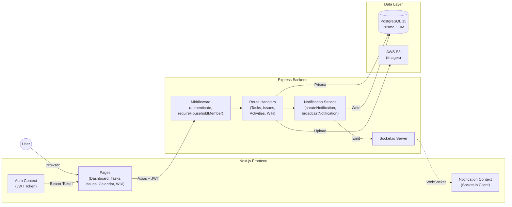

```mermaid
graph LR
  User((User))
 
  subgraph Client["Next.js Frontend"]
    Pages["Pages<br/>(Dashboard, Tasks,<br/>Issues, Calendar, Wiki)"]
    AuthCtx["Auth Context<br/>(JWT Token)"]
    NotifCtx["Notification Context<br/>(Socket.io Client)"]
  end
 
  subgraph Server["Express Backend"]
    MW["Middleware<br/>(authenticate,<br/>requireHouseholdMember)"]
    Routes["Route Handlers<br/>(Tasks, Issues,<br/>Activities, Wiki)"]
    NotifLib["Notification Service<br/>(createNotification,<br/>broadcastNotification)"]
    SocketIO["Socket.io Server"]
  end
 
  subgraph Storage["Data Layer"]
    DB[(PostgreSQL 15<br/>Prisma ORM)]
    S3["AWS S3<br/>(Images)"]
  end
 
  User -->|Browser| Pages
  AuthCtx -->|Bearer Token| Pages
  Pages -->|Axios + JWT| MW
  MW --> Routes
  Routes -->|Prisma| DB
  Routes -->|Upload| S3
  Routes --> NotifLib
  NotifLib -->|Write| DB
  NotifLib -->|Emit| SocketIO
  SocketIO -.->|WebSocket| NotifCtx
```