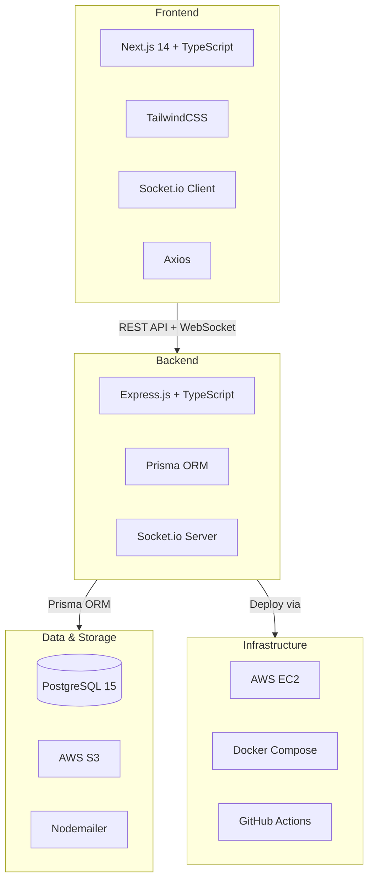

```mermaid
---
config:
  layout: dagre
---
graph TD
  subgraph Frontend["Frontend"]
    A[Next.js 14 + TypeScript]
    B[TailwindCSS]
    C[Socket.io Client]
    D[Axios]
  end
 
  subgraph Backend["Backend"]
    E[Express.js + TypeScript]
    F[Prisma ORM]
    G[Socket.io Server]
  end
 
  subgraph Data["Data & Storage"]
    I[(PostgreSQL 15)]
    J[AWS S3]
    K[Nodemailer]
  end
 
  subgraph Infra["Infrastructure"]
    L[AWS EC2]
    M[Docker Compose]
    N[GitHub Actions]
  end
 
  Frontend -->|REST API + WebSocket| Backend
  Backend -->|Prisma ORM| Data
  Backend -->|Deploy via| Infra
```